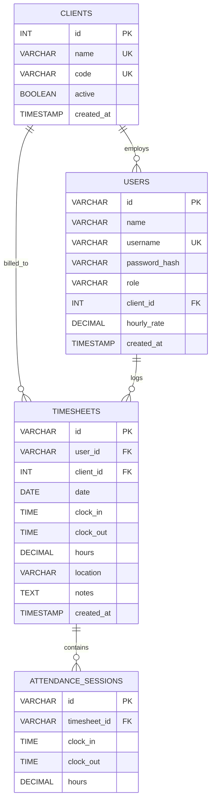

# DATABASE DESIGN: Vergil Tempo

To evolve Vergil Tempo from client-side `localStorage` to a practical, secure backend system, a relational database model (SQL) is recommended. Below is the proposed schema, optimized for SQLite or PostgreSQL.

---

## 1. Entity Relationship Diagram (ERD)



---

## 2. Table Specifications

### 2.1 Table: `clients`
Stores the client companies to which candidates are placed.
*   **Purpose:** Organizes employees and timesheets by client/project.

| Column Name | Data Type | Constraints | Description |
| :--- | :--- | :--- | :--- |
| `id` | SERIAL / INTEGER | PRIMARY KEY, AUTOINCREMENT | Unique client identifier |
| `name` | VARCHAR(100) | NOT NULL, UNIQUE | Full name of the client company (e.g., "Microsoft") |
| `code` | VARCHAR(10) | NOT NULL, UNIQUE | Short abbreviation code (e.g., "MSFT") |
| `active` | BOOLEAN | NOT NULL, DEFAULT TRUE | Status flag representing if the account is active |
| `created_at` | TIMESTAMP | DEFAULT CURRENT_TIMESTAMP | Row generation timestamp |

### 2.2 Table: `users`
Stores user accounts for both `Employee` (candidates) and `Admin` roles.
*   **Purpose:** Authentication, role routing, and placing candidates at clients.

| Column Name | Data Type | Constraints | Description |
| :--- | :--- | :--- | :--- |
| `id` | VARCHAR(36) | PRIMARY KEY | Unique ID (UUID format) |
| `name` | VARCHAR(100) | NOT NULL | Display name of the user (e.g., "John Doe") |
| `username` | VARCHAR(50) | NOT NULL, UNIQUE | Username used for login |
| `password_hash`| VARCHAR(255) | NOT NULL | Hashed password (Bcrypt) |
| `role` | VARCHAR(20) | NOT NULL | Role: `'admin'` or `'employee'` |
| `client_id` | INTEGER | NULLABLE, FOREIGN KEY | Links to `clients(id)`. NULL for Admins |
| `hourly_rate` | DECIMAL(8, 2) | NOT NULL, DEFAULT 0.00 | Billing rate in USD per hour |
| `created_at` | TIMESTAMP | DEFAULT CURRENT_TIMESTAMP | Account creation timestamp |

### 2.3 Table: `timesheets`
Stores individual work history records containing clock timestamps, notes, and locations.
*   **Purpose:** Chronological tracking of work shifts.

| Column Name | Data Type | Constraints | Description |
| :--- | :--- | :--- | :--- |
| `id` | VARCHAR(36) | PRIMARY KEY | Unique log ID (UUID or custom string) |
| `user_id` | VARCHAR(36) | NOT NULL, FOREIGN KEY | Reference to `users(id)` |
| `client_id` | INTEGER | NOT NULL, FOREIGN KEY | Reference to `clients(id)` for billing routing |
| `date` | DATE | NOT NULL | Shift date (YYYY-MM-DD) |
| `clock_in` | TIME | NOT NULL | Check-in timestamp (HH:MM:SS) |
| `clock_out` | TIME | NULLABLE | Check-out timestamp (HH:MM:SS), NULL if in progress |
| `hours` | DECIMAL(5, 2) | NULLABLE | Total shift duration in hours, NULL if in progress |
| `location` | VARCHAR(255) | NULLABLE | GPS Coordinates + City address label captured |
| `notes` | TEXT | NULLABLE | Text notes describing work completed (max 250 chars) |
| `created_at` | TIMESTAMP | DEFAULT CURRENT_TIMESTAMP | Log insertion timestamp |

### 2.4 Table: `attendance_sessions`
Stores individual work session details within a daily timesheet to support multiple clock-ins per day.
*   **Purpose:** Detailed segment-by-segment duration tracking.

| Column Name | Data Type | Constraints | Description |
| :--- | :--- | :--- | :--- |
| `id` | VARCHAR(36) | PRIMARY KEY | Unique session UUID |
| `timesheet_id` | VARCHAR(36) | NOT NULL, FOREIGN KEY | Links to `timesheets(id)` |
| `clock_in` | TIME | NOT NULL | Shift segment start timestamp (HH:MM:SS) |
| `clock_out` | TIME | NULLABLE | Shift segment end timestamp (HH:MM:SS) |
| `hours` | DECIMAL(5, 2) | NULLABLE | Shift segment duration, NULL if session in progress |

---

## 3. Database Indexes

To speed up dashboard loading, filtering, and report generations, the following database indexes are required:

1.  **`idx_timesheets_user_date`**: On `timesheets(user_id, date)`. Speeds up retrieval of individual employee logs.
2.  **`idx_timesheets_client_date`**: On `timesheets(client_id, date)`. Optimizes admin reports filtering by client company.
3.  **`idx_timesheets_date`**: On `timesheets(date)`. Speeds up search results for date range filters.
4.  **`idx_attendance_sessions_timesheet`**: On `attendance_sessions(timesheet_id)`. Speeds up retrieval of sessions for a given timesheet.

---

## 4. SQL Schema DDL Script

```sql
-- Create Clients Table
CREATE TABLE clients (
    id SERIAL PRIMARY KEY,
    name VARCHAR(100) NOT NULL UNIQUE,
    code VARCHAR(10) NOT NULL UNIQUE,
    active BOOLEAN NOT NULL DEFAULT TRUE,
    created_at TIMESTAMP DEFAULT CURRENT_TIMESTAMP
);

-- Create Users Table
CREATE TABLE users (
    id VARCHAR(36) PRIMARY KEY,
    name VARCHAR(100) NOT NULL,
    username VARCHAR(50) NOT NULL UNIQUE,
    password_hash VARCHAR(255) NOT NULL,
    role VARCHAR(20) NOT NULL CHECK (role IN ('admin', 'employee')),
    client_id INTEGER REFERENCES clients(id) ON DELETE SET NULL,
    hourly_rate DECIMAL(8, 2) NOT NULL DEFAULT 0.00,
    created_at TIMESTAMP DEFAULT CURRENT_TIMESTAMP
);

-- Create Timesheets Table
CREATE TABLE timesheets (
    id VARCHAR(36) PRIMARY KEY,
    user_id VARCHAR(36) NOT NULL REFERENCES users(id) ON DELETE CASCADE,
    client_id INTEGER NOT NULL REFERENCES clients(id),
    date DATE NOT NULL,
    clock_in TIME NOT NULL,
    clock_out TIME DEFAULT NULL,
    hours DECIMAL(5, 2) DEFAULT NULL,
    location VARCHAR(255) DEFAULT NULL,
    notes TEXT DEFAULT NULL,
    created_at TIMESTAMP DEFAULT CURRENT_TIMESTAMP
);

-- Create Attendance Sessions Table
CREATE TABLE attendance_sessions (
    id VARCHAR(36) PRIMARY KEY,
    timesheet_id VARCHAR(36) NOT NULL REFERENCES timesheets(id) ON DELETE CASCADE,
    clock_in TIME NOT NULL,
    clock_out TIME DEFAULT NULL,
    hours DECIMAL(5, 2) DEFAULT NULL
);

-- Indexes for performance optimization
CREATE INDEX idx_timesheets_user_date ON timesheets(user_id, date);
CREATE INDEX idx_timesheets_client_date ON timesheets(client_id, date);
CREATE INDEX idx_timesheets_date ON timesheets(date);
CREATE INDEX idx_attendance_sessions_timesheet ON attendance_sessions(timesheet_id);

-- Seed Initial Client Data
INSERT INTO clients (name, code) VALUES 
('Microsoft', 'MSFT'),
('Google', 'GOOG'),
('Meta', 'META'),
('Amazon', 'AMZN'),
('Netflix', 'NFLX');
```
