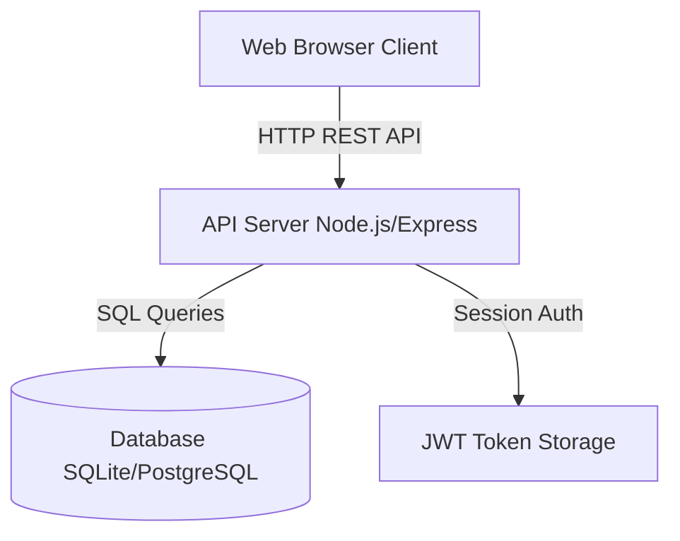

# PROJECT SCOPE: Vergil Tempo

## 1. Executive Summary
Vergil Tempo is a lightweight, high-performance Timesheet Management Portal built specifically for a staffing agency. Its primary objective is to transition from manual, error-prone working hour logs to **automatic time tracking** based on employee login (clock-in) and logout (clock-out) events. 

By capturing automated timestamps, location metadata, and activity notes at the source, Vergil Tempo ensures accuracy, reduces exaggeration in timesheets, and provides managers with real-time operational visibility.

---

## 2. Project Goals & Objectives
*   **Prevent Log Tampering:** Eliminate manual self-reporting of hours by employees. Hours must be derived automatically from clock-in/out timestamps.
*   **Operational Integrity:** Capture approximate location tags during clock events to verify work coordinates.
*   **Billing Readiness:** Enable administrators to run filters and download clean CSV records for billing client companies (e.g., Microsoft, Google, Meta) based on pre-defined candidate hourly rates.
*   **Simplicity and Security:** Deliver an intuitive UI with secure, role-based separation of data without introducing administrative overhead.

---

## 3. In-Scope Features

The system is strictly focused on timesheet tracking and administrative reporting. The core features are:

### A. User Authentication
*   Secure login and session management for two roles: **Admin** and **Employee**.
*   Hashing of credentials (on backend integration) and protection of routes.

### B. Automatic Time Tracking
*   **Clock-In:** Records date, start time, and captures approximate geolocation coordinates/address mock.
*   **Clock-Out:** Records end time, prompts the user for work notes, and calculates the shift duration (to 2 decimal places).
*   **Live Shift Ticker:** A visual running timer during active clock-in sessions.

### C. Staffing Organization
*   Classification of employees under client companies (e.g., Microsoft, Google).
*   Tracking of individual candidate billing rates ($/hour) for billing estimation.

### D. Timesheet Management & Filtering
*   **Employee View:** Access to personal log history showing Date, Clock-In, Clock-Out, Duration, Client, Location, and Work Notes.
*   **Admin View:** Master dashboard displaying currently clocked-in staff, filters by Candidate, Client Company, and Date Ranges.

### E. Reporting & Downloads
*   **Master Export:** Generate a CSV report of the filtered search results.
*   **Monthly Candidate Report:** Generate a detailed client-billing report for a specific employee and month, showing daily details, total hours, and total billable amount.

---

## 4. Out-of-Scope (Strict Boundaries)
To keep the application lightweight, the following features are **explicitly excluded**:
*   ❌ **Payroll Processing:** No bank disbursements, tax computations, or direct deposits.
*   ❌ **Invoice Generation:** No billing PDF creation, payment gateway integration, or invoice tracking.
*   ❌ **Complex Workflow Engines:** No manager-level approvals/rejections of timesheet entries. Logs are recorded directly; admins can adjust them manually if needed.
*   ❌ **Project/Task Management:** No Kanban boards, ticket assignments, or project budgets. Work notes are purely text summaries.
*   ❌ **Chat/Messaging System:** No peer communication or team chats.
*   ❌ **Notifications & Alerts:** No email/SMS reminders or browser push alerts.
*   ❌ **AI Features:** No predictive analytics, smart logs, or automated anomalies detection.

---

## 5. High-Level Architecture
Vergil Tempo is transitioning from a single-page client-only application (HTML/CSS/JS with LocalStorage) to a clean **Client-Server Architecture**:

*   **Frontend:** Vanilla HTML5, Vanilla CSS3 (custom responsive styling), and Modular Vanilla JS. Lucide for iconography, Chart.js for admin charts.
*   **Backend (Target):** Node.js with Express, providing a lightweight REST API.
*   **Database (Target):** Relational Database (SQLite for development simplicity; PostgreSQL for production).
