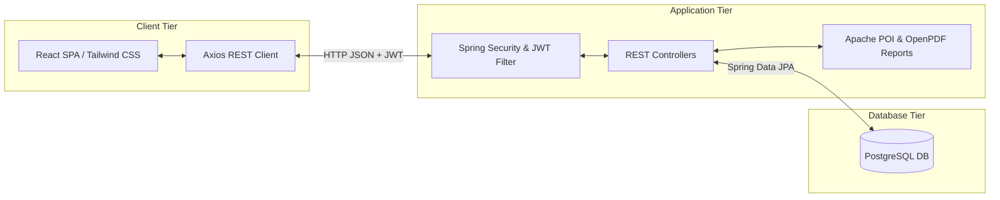

# TECHNICAL STACK SPECIFICATION: Vergil Tempo

This document outlines the selected technology stack for Vergil Tempo's migration to a production-grade full-stack timesheet tracking system.

---

## 1. Frontend Technologies

### 1.1 React
React was chosen to replace vanilla HTML/JS because of:
*   **Component-Driven Architecture:** Enables break down of the monolithic dashboard UI into modular, reusable components (e.g., `ClockCard`, `StatsGrid`, `LogsTable`, `ModalOverlay`).
*   **Virtual DOM & Reactive State:** Keeps the UI automatically in sync with the current timesheet and clock session states (e.g., ticking shift timer, live stats update) without manual DOM query selection (`document.getElementById`).
*   **Ecosystem & Standard Router:** Built-in hooks (`useState`, `useEffect`, `useContext`) and standard routing libraries (`react-router-dom`) make route protection (blocking employees from admin panels) straightforward.

### 1.2 Tailwind CSS
Tailwind CSS was chosen to replace custom CSS styles because of:
*   **Utility-First Styling:** Combines layout styling directly into components (using classes like `flex items-center justify-between shadow-md`), reducing CSS codebase size.
*   **Built-in Dark Mode & Theme Support:** Allows easy preservation of Vergil Tempo's original premium dark aesthetics (e.g., using `dark:bg-slate-900` prefixes).
*   **Responsive Modifiers:** Simplifies mobile view customization (e.g., hiding desktop navigation with `hidden md:flex` and displaying mobile bottom menus with `md:hidden`).

### 1.3 Axios
Axios is used as the HTTP client because of:
*   **Request/Response Interceptors:** Automatically attaches JWT headers to API calls and handles expired tokens globally (redirecting to login on 401 errors).
*   **Promise-based Framework:** Easier syntax and robust error-handling compared to vanilla `fetch()`.

---

## 2. Backend Technologies

### 2.1 Spring Boot
Spring Boot is the standard framework for Java backend systems:
*   **Rapid Development:** Embedded tomcat container, auto-configuration, and starter dependencies reduce boilerplate configuration code.
*   **Robust MVC REST API:** Makes exposing clean controllers and formatting JSON payloads secure and maintainable.
*   **Spring Data JPA:** Simplifies DB interactions using Repository patterns, preventing standard SQL injection attacks automatically.

### 2.2 Spring Security + JWT (JSON Web Tokens)
To transition Vergil Tempo into a secure internal application:
*   **Role-Based Security:** Protects individual REST controllers using annotations (e.g., `@PreAuthorize("hasRole('ADMIN')")`), ensuring employees cannot access administrative controls or delete log history.
*   **Stateless Authentication:** JWTs enable stateless security. The server does not maintain session states in memory; rather, tokens are passed in HTTP headers, providing horizontal scalability.
*   **Secure Password Hashing:** Integrates `BCryptPasswordEncoder` to secure user login passwords.

---

## 3. Database & Reporting

### 3.1 PostgreSQL
PostgreSQL is chosen as the production database:
*   **Relational Model Integrity:** Offers foreign key cascades, date-time indexing, and transactional isolation levels necessary for audit-ready time tracking.
*   **Query Performance:** Easily supports complex filters (employee selection, start/end dates, client company groupings) with standard indexes.

### 3.2 Apache POI
*   **Use Case:** Generates the Excel spreadsheet files.
*   **Reasoning:** Apache POI is the Java ecosystem standard for programmatically manipulating Microsoft Office formats, providing complete control over column widths, cell styling, font formatting, and math formulas for timesheet tallies.

### 3.3 OpenPDF
*   **Use Case:** Generates PDF reports (such as monthly billing statements).
*   **Reasoning:** OpenPDF is a lightweight, active, open-source fork of iText (LGPL-licensed). It provides a clean API to format, style, and draw tables, headers, and text formatting dynamically for print-ready timesheets.

---

## 4. Overall Architecture Overview

Vergil Tempo follows a decoupled Client-Server architecture pattern:

### 4.1 Data Flow of a Clock-In Event
1.  **UI Action:** Employee clicks "Clock In" on the React interface.
2.  **API Call:** Axios posts latitude/longitude metadata to `/api/timesheets/clock-in`, injecting the JWT token inside the `Authorization` header.
3.  **Security Filter:** Spring Security interceptor parses the JWT token, extracts username/roles, and validates authentication status.
4.  **Business logic:** Controller delegates request to database service, validating that no previous active shift is registered.
5.  **Persistence:** A new timesheet record is inserted into the PostgreSQL `timesheets` table with current server time.
6.  **Response:** The server returns `201 Created` with log details; React changes UI state to clocked-in and starts the ticker.
